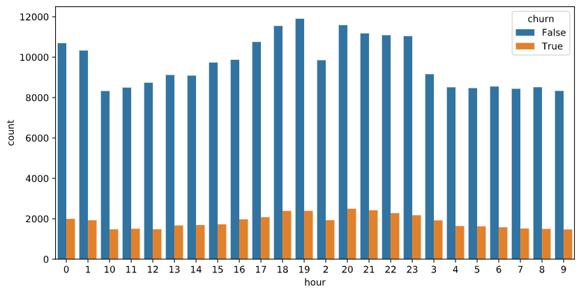
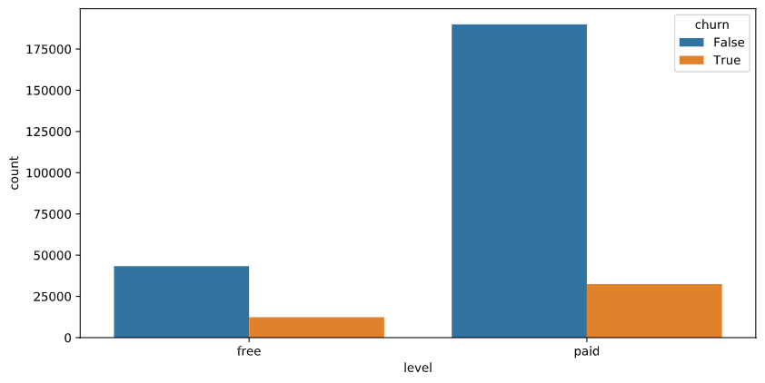
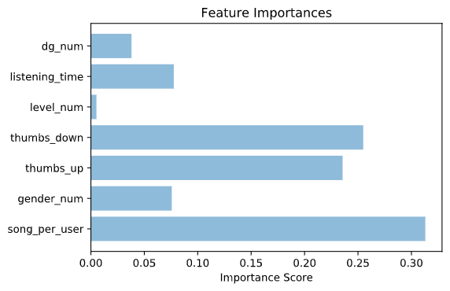

# Predicting Customer Churn Rates with Spark

Customer churn rate is a major headache for most e-commerce companies. Why do customers churn? What are the main factors for churning? Are there any patterns that enable us to predict churn rates?

Rising churn rates have major impact on revenue of e-commerce companies. Predicting them and the factors that influence churn are therefore of major importance for such companies.

This article addresses these issues and shows how to predict churn rates for a fictional company called Sparkify.
For this project I use Apache Spark and Python (PySpark)

## Sparkify Project Overview

Sparkify is a fictional music streaming service with thousands of songs and authors imitating the popular streaming service Spotify. Sparkify users stream music and interact with the app. There are two subscription levels within the app: free and paid.
The data contained in Sparkify is large. In order to process it I work with Apache Spark framework.

The generall aproach is to test the algorithm on a smaller subset of data (around 150MB) and then deploy it on the Spark cluster and test it on the whole dataset.

First, I clean the data and visualise some correlations between the variables.

As a second step I transform some features into numeric ones and also create some new features based on the existing ones.
Then I test three basic algorithms on this data subset. Based on their perfomance I select one for the final analysis.

## Data Description and Feature Engineering

The subset of Sparkify data is available in a json format containing roundabout 226 users.

Spakrify data has the following structure:

```
root
 |-- artist: string (nullable = true)
 |-- auth: string (nullable = true)
 |-- firstName: string (nullable = true)
 |-- gender: string (nullable = true)
 |-- itemInSession: long (nullable = true)
 |-- lastName: string (nullable = true)
 |-- length: double (nullable = true)
 |-- level: string (nullable = true)
 |-- location: string (nullable = true)
 |-- method: string (nullable = true)
 |-- page: string (nullable = true)
 |-- registration: long (nullable = true)
 |-- sessionId: long (nullable = true)
 |-- song: string (nullable = true)
 |-- status: long (nullable = true)
 |-- ts: long (nullable = true)
 |-- userAgent: string (nullable = true)
 |-- userId: string (nullable = true)
```
Despite being relatively small, the data contains many information about user interaction with the app. In order to extract some relevant information I initially clean and restructure the data.

As a first step I remove the duplicates, null values and some less relevant information. In the second step I calculate some new features based on the existing ones.

I also create a churn feature from the dataset based on the "Cancellation Confirmation" and downgrade feature from "Downgrade" and  included them in the dataset.

### Potential Factors for Churn — Visualisation

Before implementing more advanced analysis tools, I first look at the data via some visualisations. This approach allows me to verify, whether there are some direct relationships visually apparent in the user interactions.

#### Is churn related to particular time variable like hour of the day ?



#### Do paying users churn more than the free subscribtion users?



## Modelling

Within the Apache Spark framework not all of the machine learning algorithms are supported. My modelling strategy has to account for this fact.

As a first step I implement three basic algorithms without any specific parameter tuning:

- Logistic Regression
- Random Forrest
- Gradient Boosting

Due to the fact that the dataset is strongly imbalanced between the users who churned and those who did not churn I implement F1 score as the indicator for a sucessful prediction.

### Basic Approach: Logistic Regression, Random Forest and Gardient Boosting

In the basic approach three algorithms are tested: logistic regression, random forest and gradient boosting in order to check their performance on the F1 score.

Gradient boosting algorithm performs best with a F1 score of 83%.

In the next step I implement gradient boosting with paremeters tuned as follows:
- 3-fold crossvalidation
- max number of iterations: 5, 10
- max depth: 4, 12

After implementing this strategy the F1 score remains at 83%.

### Results and Conclusion

Based on this strategy, the best performing algorithm is gardient boosting.




Based on the above visualisation, the factors that influence churn rate most are: number of songs played per user, user engagement as displayed by the number of given thumbs (down or up) and total listening time.
